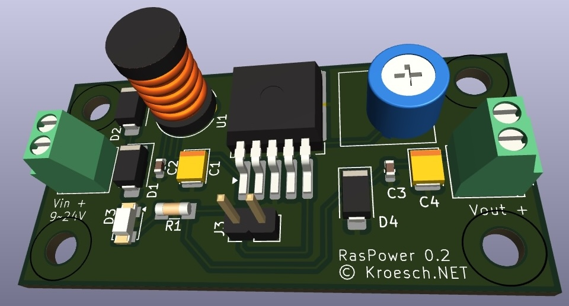

# RasPower

Powering Raspberry Pi (starting from Mode 3) in a device where DC power is already available.
The circuit provides reverse polarity protection, overvoltage protection, and filtering of high-frequency interference into the power supply, and it prevents backfeeding from the powered device.

